# 🔴 Active Directory Attack Lab – End-to-End Attack Simulation

## 📌 Overview

This project simulates a real-world Active Directory compromise in a controlled lab environment.  

The objective was to replicate a full attack lifecycle — from initial access to domain dominance — while also analyzing detection opportunities through centralized logging (Sysmon + Splunk).

---

## 🏢 Scenario

This lab simulates a fictional company, **Solaris Creative**, a fast-growing digital agency managing sensitive client data.

As the organization's Security Engineer, the objective was to design, deploy, and assess the security of a centralized Active Directory environment, while monitoring activity through Splunk.

The environment reflects common real-world challenges such as rapid scaling, weak credential practices, and misconfigured access controls.

---

## 🎯 Objectives

- Simulate common enterprise attack techniques
- Perform credential harvesting and abuse
- Achieve lateral movement across systems
- Escalate privileges to Domain Admin
- Analyze logs and identify detection opportunities

---

## 🏗️ Lab Environment

### 🖥️ Infrastructure

- **Domain Controller:** Windows Server 2022 (SOLARIS-DC-01)
- **Client Machine:** Windows 11 (SOLARIS-PC-01)
- **Attacker Machine:** Kali Linux
- **SIEM Server:** Ubuntu (Splunk + Sysmon ingestion)

### 🌐 Network

- Domain: `solaris.local`
- Internal IP Range: `192.168.10.0/24`

---

## ⚙️ Environment Configuration

### 🔧 Active Directory Setup

- Domain created: `solaris.local`
- Automated provisioning via PowerShell (`provision.ps1`)

Organizational Units (OUs):

- 01-Executives
- 02-Creative
- 03-Finance
- 04-IT-Admin
- 05-Service-Accounts

Provisioning was performed via a PowerShell script to simulate scalable enterprise deployment rather than manual configuration.

### 👥 User Simulation

- 9 domain users created via PowerShell automation
- Realistic attributes (department, role, descriptions)
- Multiple password patterns used (e.g., `Solaris2026!`, `AdminSolaris!`, `Backup123!`)

⚠️ Simulates weak and inconsistent enterprise credential practices

### 🔗 Domain Integration

- Windows 11 machine joined to domain
- Users mapped to appropriate groups

---

## ⚠️ Intentional Vulnerabilities

To simulate real-world weaknesses:

- LLMNR & NetBIOS enabled → Responder attacks
- Weak password policy → Password spraying risk
- Overprivileged accounts (e.g., helpdesk user)
- SMB share exposed to Domain Users
- Windows Defender partially disabled via GPO
- SMBv1 enabled on selected host

---

## 📊 Logging & Monitoring

- Sysmon deployed on endpoints
- Logs forwarded to Splunk server
- Enables detection of:
  - Credential dumping
  - Lateral movement
  - Suspicious authentication patterns

---

# ⚔️ Attack Simulation

## Phase 1: Initial Foothold (Responder)
Captured NTLMv2 hash via LLMNR/NBT-NS poisoning attack.

- Verified LLMNR and NetBIOS were enabled on the target system
- Configured Responder to intercept SMB authentication requests
- Forced authentication from domain user using SMB share request
- Successfully captured NTLMv2 hash for SOLARIS\p.olson

> "Intercepted broadcast name resolution traffic and captured NTLMv2 authentication hash via rogue SMB response."

### 📸 Evidence

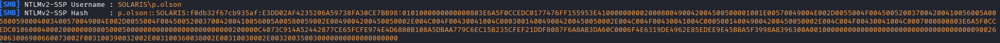

[View SMB authentication trigger](screenshots/phase1/phase1-smb-trigger.png)

---

## Phase 2: Credential Validation (CrackMapExec)

Attempted offline password cracking using Hashcat and a common wordlist.

- Extracted NTLMv2 hash from Responder output
- Executed dictionary attack using rockyou.txt
- Attack completed but no valid password was recovered

> "Password was not present in common wordlists, indicating stronger or non-standard credential usage."

Pivoted to credential validation techniques after unsuccessful password cracking.

- Tested captured credentials across internal network using CrackMapExec
- Successfully authenticated to domain systems using a weak, predictable password (Solaris2026!)
- Confirmed that compromised credentials provide access within the domain environment

> "Validated that compromised credentials could be used for authentication across domain systems, enabling lateral movement."

### 📸 Evidence

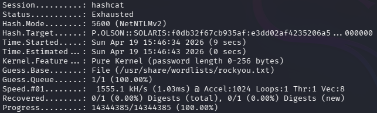

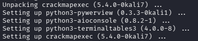

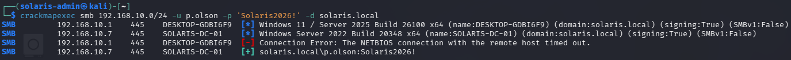

---

## Phase 3: Domain Enumeration (BloodHound)
Mapped Active Directory relationships and analyzed potential attack paths.

> "Enumerated domain objects and confirmed absence of direct privilege escalation paths."

- Configured attacker DNS to use Domain Controller for proper AD resolution
- Executed BloodHound data collection using compromised domain credentials
- Successfully enumerated users, groups, computers, and domain structure
- Imported collected data into BloodHound for analysis
- Identified compromised user `p.olson@solaris.local` as member of:
  - `Domain Users`
  - `Users`

> "Compromised account operates with standard domain user privileges."

- Analyzed object permissions and identified inbound control relationships:
  - GenericWrite
  - WriteDacl
  - AddKeyCredentialLink

> "Identified inbound ACL relationships that may enable privilege abuse under specific conditions."

- Performed pathfinding analysis to Domain Admins
- No valid privilege escalation path identified

> "No direct privilege escalation path to Domain Admins found."

Conclusion:

- Confirmed that the compromised account has limited privileges within the domain
- No misconfigurations allowing immediate escalation were identified
- Demonstrated that enumeration is critical to validate attack paths before exploitation
- Established need for lateral movement and post-exploitation techniques for further compromise

### 📸 Evidence

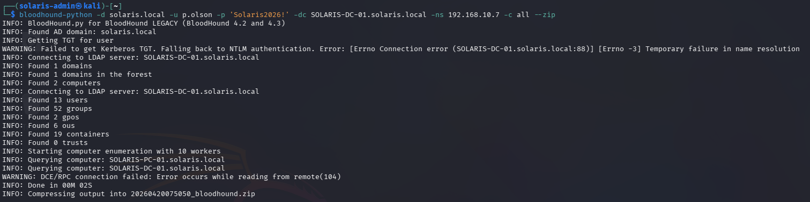 

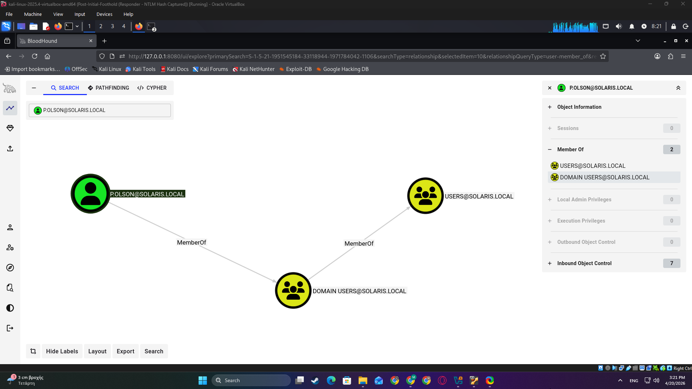 

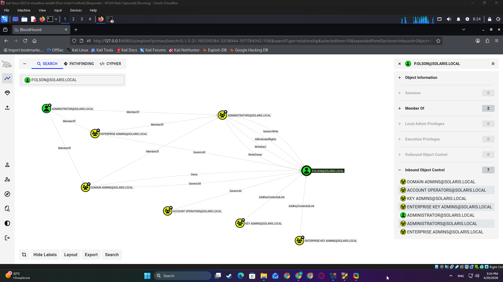 

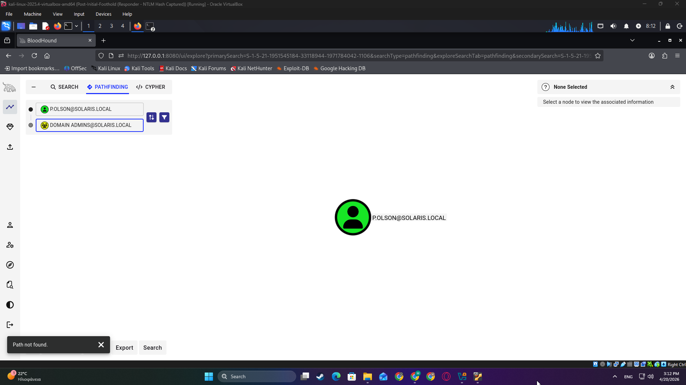
---

## Phase 4: Lateral Movement (Impacket)

Attempted remote command execution using previously validated domain credentials.

- Used Impacket psexec to attempt remote execution over SMB
- Authentication succeeded but access to administrative shares (ADMIN$, C$) was denied

> "Valid credentials did not grant sufficient privileges for remote service creation."

- Attempted alternative execution method using wmiexec
- Received RPC access denied response

> "User lacked necessary privileges for remote command execution via WMI."

Conclusion:

- Confirmed that while credentials are valid, the compromised account does not have administrative privileges on the target system
- Demonstrated enforcement of privilege boundaries within the domain environment

### 📸 Evidence

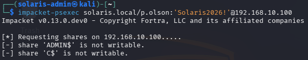

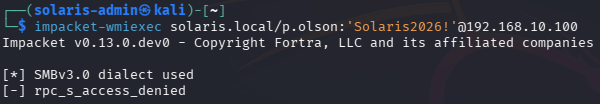

---

## Phase 5: Credential Dumping (LSASS Memory Analysis)

Attempted credential extraction from LSASS memory after identifying lack of direct privilege escalation paths.

> "Initial LSASS dump did not reveal usable credentials, indicating absence of active authentication material."

- Executed LSASS memory dump using ProcDump on the target machine
- Transferred dump file to attacker machine for offline analysis
- Parsed memory dump using pypykatz

> "Only DPAPI-related material was recovered, suggesting no cached credentials were present."

Pivoted strategy to force authentication:

- Triggered SMB authentication using valid domain credentials
- Generated a new logon session (network authentication)
- Created a second LSASS dump after authentication event

> "Authentication activity caused credentials to be stored in LSASS memory."

- Re-analyzed updated memory dump using pypykatz
- Successfully extracted high-privileged credentials

> "Recovered Administrator credentials including NTLM hash and cleartext password."

### 🔑 Extracted Credentials

- Username: Administrator
- Domain: SOLARIS
- NTLM Hash: cf5ada20039b287784039a7b266d3c08
- Cleartext Password: (3vRPShicosHuyAv

### 🎯 Impact

- Demonstrates how attackers can extract credentials post-authentication
- Enables lateral movement using valid credentials or pass-the-hash techniques
- Highlights risk of credential exposure in memory on active systems

### 📸 Evidence

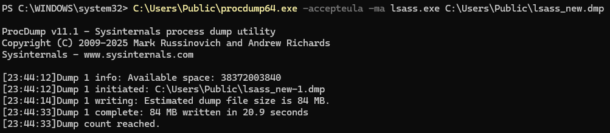

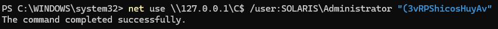

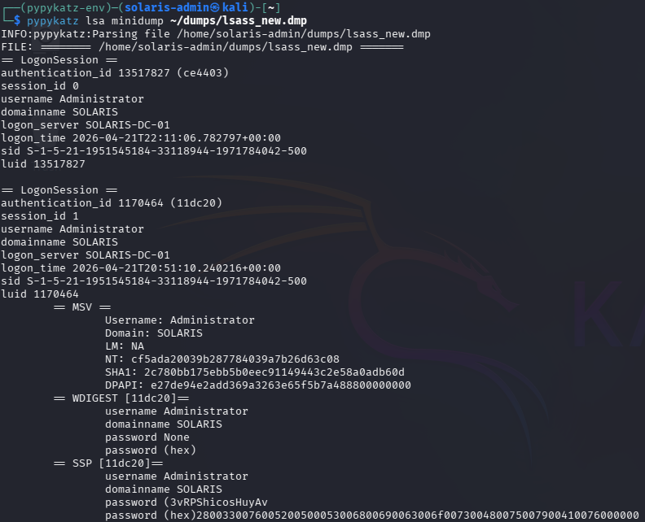

---

## Phase 6: Lateral Movement via SMB (Administrative Share Access)

Leveraged extracted Administrator credentials to access the Domain Controller and validate lateral movement.

> "Valid credentials enabled authenticated access to remote administrative resources."

- Authenticated to Domain Controller via SMB using Administrator credentials
- Accessed default administrative share (C$)
- Established direct interaction with remote file system

> "Administrative share access confirms high-privilege authentication on the target system."

- Navigated to sensitive system directories
- Accessed Windows registry hive storage location

> "Presence of registry hive files indicates full administrative access to the system."

- Verified access to credential storage files (SAM, SYSTEM, SECURITY)
- Confirmed ability to interact with protected OS components

> "Access to these files enables credential extraction and full system compromise."

### 🎯 Impact

- Demonstrates successful lateral movement to Domain Controller  
- Confirms administrative-level access on a critical system  
- Enables potential credential extraction and privilege escalation  
- Represents full compromise of the Active Directory environment  

### 📸 Evidence

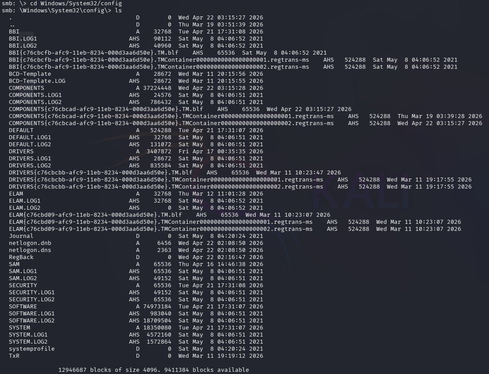

---

# 🔍 Detection & Analysis

### Key Indicators of Compromise (IOCs)
- Abnormal NTLMv2 authentication traffic
- Multiple failed login attempts (password spraying)
- Suspicious process creation (Mimikatz)
- Remote execution events

### Example Logs
- Event ID 4624 (Logon)
- Event ID 4625 (Failed logon)
- Sysmon Event ID 1 (Process creation)
- Sysmon Event ID 10 (Process access)

---

# 🛡️ Mitigation Strategies

- Disable LLMNR & NetBIOS
- Enforce strong password policies
- Implement least privilege access
- Restrict SMB share permissions
- Monitor authentication anomalies
- Enable Defender / EDR protections

---

# 🧠 Lessons Learned

- Weak credentials remain a critical entry point
- Misconfigured privileges enable rapid escalation
- Visibility (logging) is essential for detection
- Attack paths in AD are often non-obvious without tools like BloodHound

---

# 📸 Screenshots

- Lab architecture diagram
- AD user structure
- PowerShell automation output
- Sysmon installation
- Attack execution evidence

---

# 🚀 Key Takeaways

This lab demonstrates the ability to:
- Build and secure an AD environment
- Simulate real-world attack techniques
- Analyze attacker behavior through logs
- Understand both offensive and defensive perspectives

---
