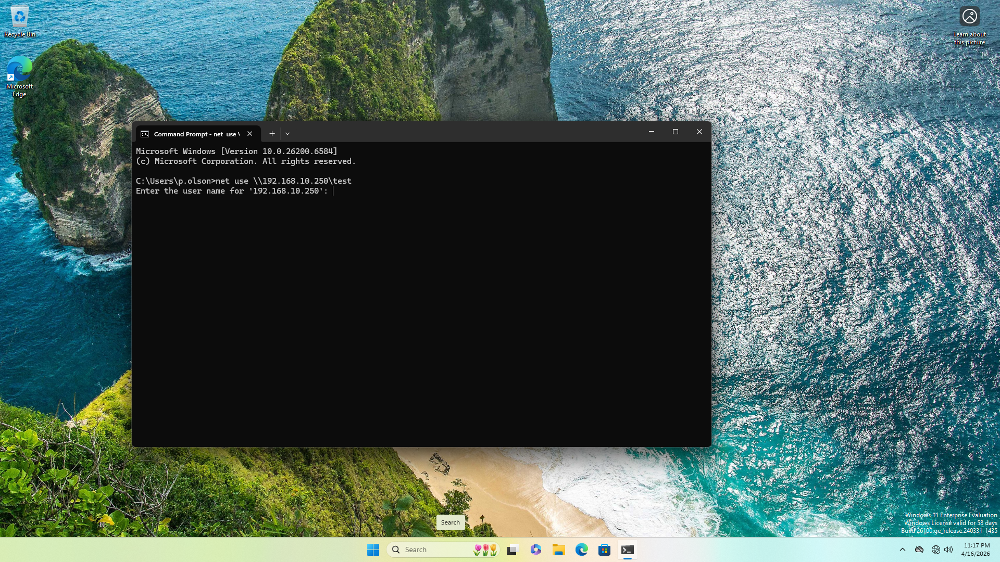
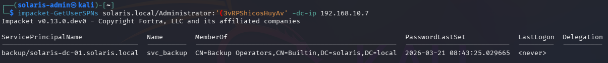
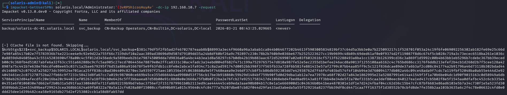
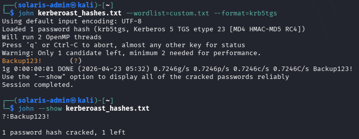
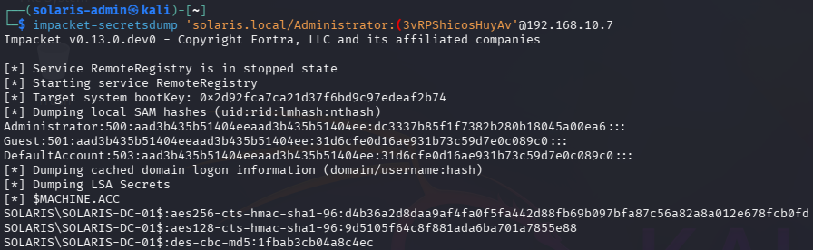
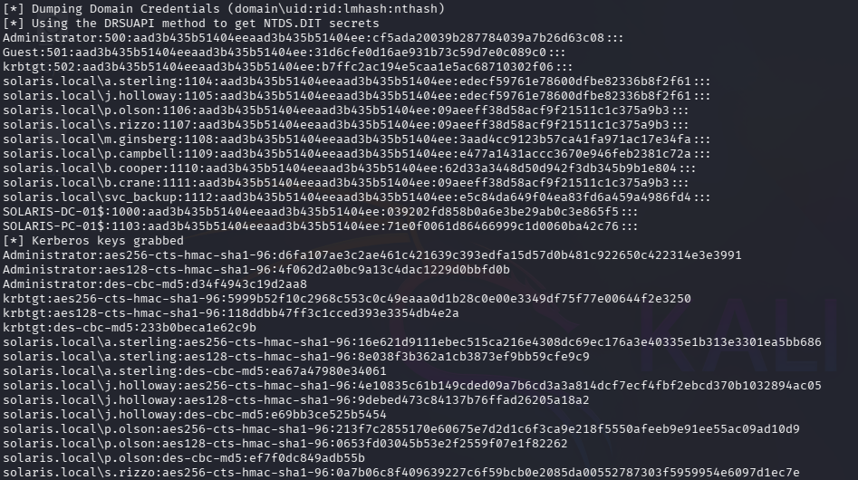

# 🔴 Active Directory Attack Lab – End-to-End Attack Simulation

## 📌 Overview

This project simulates a full Active Directory compromise in a controlled lab environment, replicating a realistic attack chain from initial access to domain dominance.

The lab focuses on offensive techniques including credential harvesting, lateral movement, Kerberoasting, and domain credential extraction, while also highlighting detection opportunities through centralized logging (Sysmon + Splunk).

The goal is to demonstrate both attacker methodology and defensive visibility within an enterprise network.

---

## 🏢 Scenario

This lab represents a mid-sized enterprise environment (**Solaris Creative**) with a centralized Active Directory infrastructure.

The environment includes typical enterprise characteristics such as:
- Multiple user roles and departments
- Service accounts with elevated privileges
- Weak password practices
- Misconfigured access controls

The objective is to identify and exploit these weaknesses to achieve full domain compromise.

---

## 🎯 Objectives

- Simulate real-world Active Directory attack techniques
- Perform credential harvesting and abuse
- Achieve lateral movement across domain systems
- Escalate privileges to Domain Admin level
- Identify detection opportunities through log analysis

---

## 🏗️ Lab Environment

### 🖥️ Infrastructure

- **Domain Controller:** Windows Server 2022 (SOLARIS-DC-01)
- **Client Machine:** Windows 11 (SOLARIS-PC-01)
- **Attacker Machine:** Kali Linux
- **SIEM Server:** Ubuntu (Splunk + Sysmon ingestion)

### 🌐 Network

- Domain: `solaris.local`
- Internal IP Range: `192.168.10.0/24`

---

## ⚙️ Environment Configuration

### 🔧 Active Directory Setup

- Domain created: `solaris.local`
- Automated provisioning via PowerShell (`provision.ps1`)

Organizational Units (OUs):

- 01-Executives
- 02-Creative
- 03-Finance
- 04-IT-Admin
- 05-Service-Accounts

Provisioning was performed via a PowerShell script to simulate scalable enterprise deployment rather than manual configuration.

### 👥 User Simulation

- 9 domain users created via PowerShell automation
- Realistic attributes (department, role, descriptions)
- Multiple password patterns used (e.g., `Solaris2026!`, `AdminSolaris!`, `Backup123!`)

⚠️ Simulates weak and inconsistent enterprise credential practices

### 🔗 Domain Integration

- Windows 11 machine joined to domain
- Users mapped to appropriate groups

---

## ⚠️ Intentional Vulnerabilities

To simulate real-world weaknesses:

- LLMNR & NetBIOS enabled → Responder attacks
- Weak password policy → Password spraying risk
- Overprivileged accounts (e.g., helpdesk user)
- SMB share exposed to Domain Users
- Windows Defender partially disabled via GPO
- SMBv1 enabled on selected host

---

## 📊 Logging & Monitoring

- Sysmon deployed on endpoints
- Logs forwarded to Splunk server

This setup enables basic visibility into:
- Authentication events
- Process creation
- Lateral movement activity

Detailed detection analysis will be explored in a separate SOC-focused project.

---

# ⚔️ Attack Simulation

## Phase 1: Initial Foothold (Responder)
Captured NTLMv2 hash via LLMNR/NBT-NS poisoning attack.

- Verified LLMNR and NetBIOS were enabled on the target system
- Configured Responder to intercept SMB authentication requests
- Forced authentication from domain user using SMB share request
- Successfully captured NTLMv2 hash for SOLARIS\p.olson

> "Intercepted broadcast name resolution traffic and captured NTLMv2 authentication hash via rogue SMB response."

### 📸 Evidence

---

## Phase 2: Credential Validation (CrackMapExec)

Attempted offline password cracking using Hashcat and a common wordlist.

- Extracted NTLMv2 hash from Responder output
- Executed dictionary attack using rockyou.txt
- Attack completed but no valid password was recovered

> "Password was not present in common wordlists, indicating stronger or non-standard credential usage."

Pivoted to credential validation techniques after unsuccessful password cracking.

- Tested captured credentials across internal network using CrackMapExec
- Successfully authenticated to domain systems using a weak, predictable password (Solaris2026!)
- Confirmed that compromised credentials provide access within the domain environment

> "Validated that compromised credentials could be used for authentication across domain systems, enabling lateral movement."

### 📸 Evidence

---

## Phase 3: Domain Enumeration (BloodHound)
Mapped Active Directory relationships and analyzed potential attack paths.

> "Enumerated domain objects and confirmed absence of direct privilege escalation paths."

- Configured attacker DNS to use Domain Controller for proper AD resolution
- Executed BloodHound data collection using compromised domain credentials
- Successfully enumerated users, groups, computers, and domain structure
- Imported collected data into BloodHound for analysis
- Identified compromised user `p.olson@solaris.local` as member of:
  - `Domain Users`
  - `Users`

> "Compromised account operates with standard domain user privileges."

- Analyzed object permissions and identified inbound control relationships:
  - GenericWrite
  - WriteDacl
  - AddKeyCredentialLink

> "Identified inbound ACL relationships that may enable privilege abuse under specific conditions."

- Performed pathfinding analysis to Domain Admins
- No valid privilege escalation path identified

> "No direct privilege escalation path to Domain Admins found."

Conclusion:

- Confirmed that the compromised account has limited privileges within the domain
- No misconfigurations allowing immediate escalation were identified
- Demonstrated that enumeration is critical to validate attack paths before exploitation
- Established need for lateral movement and post-exploitation techniques for further compromise

### 📸 Evidence

 

 

 

---

## Phase 4: Lateral Movement Attempt (Impacket)

Attempted remote command execution using previously validated domain credentials.

- Used Impacket psexec to attempt remote execution over SMB
- Authentication succeeded but access to administrative shares (ADMIN$, C$) was denied

> "Valid credentials did not grant sufficient privileges for remote service creation."

- Attempted alternative execution method using wmiexec
- Received RPC access denied response

> "User lacked necessary privileges for remote command execution via WMI."

Conclusion:

- Confirmed that while credentials are valid, the compromised account does not have administrative privileges on the target system
- Demonstrated enforcement of privilege boundaries within the domain environment

### 📸 Evidence

---

## Phase 5: Credential Dumping (LSASS Memory Analysis)

Attempted credential extraction from LSASS memory after identifying lack of direct privilege escalation paths.

> "Initial LSASS dump did not reveal usable credentials, indicating absence of active authentication material."

- Executed LSASS memory dump using ProcDump on the target machine
- Transferred dump file to attacker machine for offline analysis
- Parsed memory dump using pypykatz

> "Only DPAPI-related material was recovered, suggesting no cached credentials were present."

Pivoted strategy to force authentication:

- Triggered SMB authentication using valid domain credentials
- Generated a new logon session (network authentication)
- Created a second LSASS dump after authentication event

> "Authentication activity caused credentials to be stored in LSASS memory."

- Re-analyzed updated memory dump using pypykatz
- Successfully extracted high-privileged credentials

> "Administrator credentials were present in LSASS due to active or recent authentication activity."

> "Recovered Administrator credentials including NTLM hash and cleartext password."

### 🔑 Extracted Credentials

- Username: Administrator
- Domain: SOLARIS
- NTLM Hash: cf5ada20039b287784039a7b266d3c08
- Cleartext Password: (3vRPShicosHuyAv

### 🎯 Impact

- Demonstrates how attackers can extract credentials post-authentication
- Enables lateral movement using valid credentials or pass-the-hash techniques
- Highlights risk of credential exposure in memory on active systems

### 📸 Evidence

---

## Phase 6: Successful Lateral Movement via SMB (Administrative Share Access)

Leveraged extracted Administrator credentials to access the Domain Controller and validate lateral movement.

> "Valid credentials enabled authenticated access to remote administrative resources."

- Authenticated to Domain Controller via SMB using Administrator credentials
- Accessed default administrative share (C$)
- Established direct interaction with remote file system

> "Administrative share access confirms high-privilege authentication on the target system."

- Navigated to sensitive system directories
- Accessed Windows registry hive storage location

> "Presence of registry hive files indicates full administrative access to the system."

- Verified access to credential storage files (SAM, SYSTEM, SECURITY)
- Confirmed ability to interact with protected OS components

> "Access to these files enables credential extraction and full system compromise."

### 🎯 Impact

- Demonstrates successful lateral movement to Domain Controller  
- Confirms administrative-level access on a critical system  
- Enables potential credential extraction and privilege escalation  
- Represents full compromise of the Active Directory environment  

### 📸 Evidence

---
## Phase 7: Kerberoasting (Service Account Credential Extraction)

Performed Kerberoasting attack against service accounts configured with Service Principal Names (SPNs).

> "Identified service account with SPN configured, making it a viable Kerberoasting target."

- Enumerated SPNs using Impacket
- Identified `svc_backup` as a service account with SPN
- Confirmed account membership in Backup Operators

> "Service account exposure allows extraction of Kerberos service tickets for offline cracking."

- Requested Kerberos service ticket (TGS) for the target account
- Extracted encrypted ticket hash for offline analysis

> "Kerberos TGS hash successfully obtained for svc_backup."

- Attempted password cracking using standard wordlist (rockyou)
- Initial attempt failed due to wordlist mismatch

> "Default wordlist did not contain the target password."

- Switched to targeted/custom wordlist
- Successfully cracked Kerberos hash using John the Ripper

> "Recovered cleartext password for service account."

### 🔑 Extracted Credentials

- Username: svc_backup
- Domain: SOLARIS
- Cleartext Password: Backup123!

### 🎯 Impact

- Demonstrates risk of weak passwords in service accounts with SPNs
- Enables offline password cracking without further interaction with target
- Provides additional foothold for privilege escalation and lateral movement
- Highlights how misconfigured service accounts expand attack surface

### 📸 Evidence

### ⚠️ Privilege Escalation Attempt (Backup Operators Abuse)

Attempted to leverage `svc_backup` membership in Backup Operators group to extract domain data via Volume Shadow Copy (VSS).

> "Backup Operators possess privileges to read sensitive system files, including NTDS.dit."

- Attempted remote NTDS extraction using Impacket secretsdump
- DRSUAPI method failed due to insufficient privileges
- VSS method also restricted due to lack of remote execution capabilities

> "Backup Operators privileges alone were insufficient for remote exploitation in this configuration."

Pivoted strategy:

- Leveraged previously obtained Administrator credentials
- Proceeded with domain extraction using high-privileged access

---
## Phase 8: Domain Compromise (NTDS.dit Extraction)

Achieved full Active Directory compromise by extracting domain credentials from the Domain Controller using previously obtained high-privileged access.

> "High-privileged credentials enabled direct access to the Active Directory database."

- Leveraged Administrator credentials obtained from LSASS memory dumping
- Authenticated to Domain Controller remotely
- Executed NTDS.dit extraction using Impacket secretsdump

> "Successful extraction of NTDS.dit provided access to all domain user credential hashes."

- Dumped domain credential database (NTDS.dit)
- Extracted NTLM password hashes for all domain users
- Retrieved sensitive accounts including Administrator and krbtgt

> "Compromise of krbtgt account enables potential Golden Ticket attacks and persistent domain access."

- Obtained Kerberos encryption keys (AES/RC4)
- Confirmed full visibility of Active Directory user base

### 🎯 Impact

- Demonstrates complete compromise of Active Directory environment
- Provides access to all domain user credentials
- Enables privilege escalation, lateral movement, and persistence
- Allows potential Kerberos ticket forging (Golden Ticket attacks)

### 📸 Evidence

---

# 🔍 Detection Considerations

Key observable behaviors during the attack chain include:

- LLMNR/NBT-NS poisoning activity (Responder)
- Abnormal authentication patterns across hosts
- LSASS memory access (credential dumping)
- Remote SMB access to administrative shares
- Kerberos service ticket requests (Kerberoasting)

Relevant logs:

- Windows Event ID 4624 / 4625 (Authentication)
- Sysmon Event ID 1 (Process creation)
- Sysmon Event ID 10 (Process access)

> Full detection engineering and log analysis will be covered in a dedicated SOC project.

---

# 🛡️ Mitigation Strategies

- Disable LLMNR & NetBIOS to prevent poisoning attacks
- Enforce strong password policies and account lockouts
- Apply least privilege principles across user and service accounts
- Restrict access to administrative SMB shares
- Monitor authentication anomalies and lateral movement patterns
- Enable endpoint protection (Defender / EDR)

---

# 🧠 Lessons Learned

- Valid credentials do not always imply sufficient privilege for exploitation
- Credential exposure in memory can enable rapid privilege escalation
- Service accounts with SPNs significantly increase attack surface
- Multiple attack paths may fail, requiring adaptive strategy
- Full domain compromise is often achieved through chaining techniques, not a single vulnerability

---

# 🚀 Key Takeaways

This project demonstrates:

- End-to-end Active Directory attack simulation
- Realistic attacker decision-making and pivoting
- Practical use of industry tools (Impacket, BloodHound, Responder, John)
- Ability to identify and exploit misconfigurations in enterprise environments
- Understanding of both offensive techniques and defensive visibility

---
