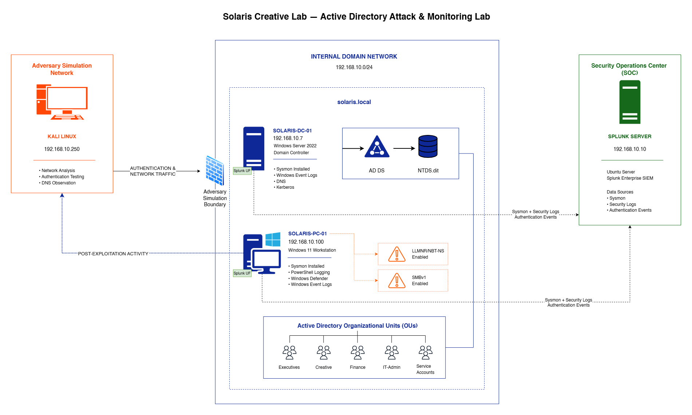
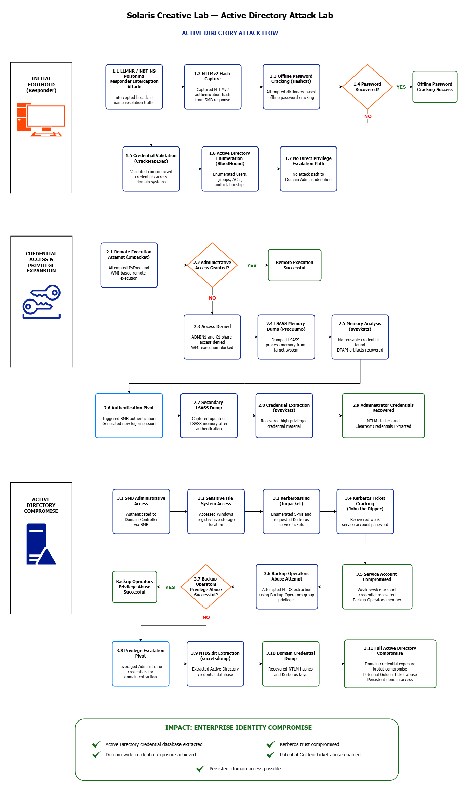

# 🔴 Active Directory Attack Lab — End-to-End Enterprise Attack Simulation

## 📌 Overview

This project simulates a full Active Directory compromise within a controlled enterprise lab environment, replicating realistic attacker methodology from initial access to full domain compromise.

The lab focuses on offensive security techniques including credential harvesting, domain enumeration, lateral movement, Kerberoasting, credential dumping, and Active Directory database extraction. The environment also integrates centralized logging through Sysmon and Splunk to provide defensive visibility into attacker activity.

The objective of this project is to demonstrate both offensive tradecraft and security monitoring considerations within a modern Windows domain environment.

The project emphasizes realistic attacker decision-making, operational pivots, failed attack paths, and enterprise Active Directory attack surface analysis rather than isolated proof-of-concept exploitation.

> ⚠️ This lab was built strictly for educational and defensive security research purposes inside an isolated environment.

---

# 🏢 Enterprise Lab Architecture



---

# ⚔️ Attack Flow Overview



---

# 🎯 Attack Chain Summary

| Phase | Technique | Tool(s) | Result |
|---|---|---|---|
| 1 | LLMNR/NBT-NS Poisoning | Responder | Captured NTLMv2 Hash |
| 2 | Credential Validation | CrackMapExec | Valid Domain Credentials |
| 3 | Active Directory Enumeration | BloodHound | ACL & Relationship Discovery |
| 4 | Remote Execution Attempt | Impacket | Access Denied |
| 5 | LSASS Memory Dumping | ProcDump + pypykatz | Administrator Credentials Recovered |
| 6 | SMB Administrative Access | smbclient | Domain Controller Access |
| 7 | Kerberoasting | Impacket + John | Service Account Password Recovered |
| 8 | NTDS.dit Extraction | secretsdump | Full Domain Compromise |

---

# 🧠 Skills Demonstrated

- Active Directory Enumeration
- Windows Authentication Abuse
- LLMNR/NBT-NS Poisoning
- Credential Harvesting
- Password Cracking
- Lateral Movement Techniques
- Kerberoasting
- LSASS Credential Dumping
- SMB Administrative Share Abuse
- NTDS.dit Extraction
- BloodHound Analysis
- Sysmon Monitoring
- Splunk Log Ingestion
- Attack Path Analysis
- Detection Opportunity Identification

---

# 🛠️ Tools & Technologies Used

## Offensive Tooling
- Responder
- CrackMapExec
- BloodHound
- Impacket
- ProcDump
- pypykatz
- John the Ripper
- smbclient
- Hashcat

## Infrastructure & Monitoring
- Windows Server 2022
- Windows 11
- Kali Linux
- Ubuntu Server
- Sysmon
- Splunk Enterprise
- PowerShell

---

# 🔍 Project Highlights

- Simulates a realistic enterprise Active Directory environment
- Demonstrates realistic attacker methodology and operational pivoting
- Includes failed attack paths and operational pivots
- Uses automated Active Directory provisioning via PowerShell
- Combines offensive techniques with defensive visibility
- Documents authentication abuse and credential exposure scenarios
- Highlights common enterprise misconfigurations and attack surface weaknesses

---

# 🏗️ Lab Environment

| System | Role | Operating System |
|---|---|---|
| SOLARIS-DC-01 | Domain Controller | Windows Server 2022 |
| SOLARIS-PC-01 | Domain Workstation | Windows 11 |
| Kali Linux | Attacker System | Kali Linux |
| Splunk Server | SIEM Platform | Ubuntu Server |

## 🌐 Network Information

- Domain: `solaris.local`
- Internal Network: `192.168.10.0/24`

---

# ⚠️ Intentional Vulnerabilities

The lab includes several intentionally misconfigured components to simulate realistic enterprise weaknesses:

- LLMNR & NetBIOS enabled
- Weak password practices
- Overprivileged accounts
- SMB administrative exposure
- SMBv1 enabled on selected systems
- Partial Windows Defender hardening gaps
- Service accounts with SPNs configured

> ⚠️ Passwords included within provisioning resources are intentionally weak and exposed for educational attack simulation purposes inside an isolated lab environment.

---

# 👥 Active Directory Structure

The environment includes multiple Organizational Units (OUs) to simulate enterprise segmentation and user distribution:

- Executives
- Creative
- Finance
- IT-Admin
- Service Accounts

User provisioning and OU population were automated through PowerShell scripting to simulate scalable enterprise deployment practices.

---

# 📊 Monitoring & Detection Visibility

Sysmon and Windows Event Logs were configured on domain systems and forwarded into Splunk Enterprise for centralized monitoring.

Observable attack behaviors include:

- LLMNR/NBT-NS poisoning activity
- Authentication anomalies
- LSASS process access
- Kerberos service ticket requests
- Remote SMB administrative access
- Suspicious process creation activity
- Kerberos authentication anomalies

Relevant event sources include:

- Windows Security Event Logs
- Sysmon Event ID 1 (Process Creation)
- Sysmon Event ID 10 (Process Access)
- Windows Event ID 4624 / 4625
- Kerberos Event ID 4769

---

# 🛡️ Mitigation Strategies

- Disable LLMNR & NetBIOS
- Enforce strong password policies
- Apply least privilege access controls
- Restrict SMB administrative share access
- Monitor authentication anomalies
- Harden LSASS protections
- Deploy endpoint detection and response (EDR)

---

# 🔗 Related SOC Investigation Project

This project focuses primarily on the offensive attack chain and adversary methodology.

The associated defensive investigation, Splunk analysis, detection engineering, and SOC workflow documentation are covered in the companion project:

➡️ [SOC-Incident-Investigation](YOUR_LINK_HERE)

---

# 📂 Repository Structure

```text
Active-Directory-Attack-Lab/
│
├── README.md
│
├── docs/
│   ├── architecture.md
│   ├── attack-path.md
│   ├── detection-opportunities.md
│   ├── mitigation-strategies.md
│   ├── lessons-learned.md
│   └── mitre-mapping.md
│
├── phases/
│   ├── 01-initial-access/
│   │   ├── overview.md
│   │   ├── commands.md
│   │   ├── findings.md
│   │   └── screenshots/
│   │
│   ├── 02-credential-validation/
│   │   ├── overview.md
│   │   ├── commands.md
│   │   ├── findings.md
│   │   └── screenshots/
│   │
│   ├── 03-enumeration/
│   │   ├── overview.md
│   │   ├── commands.md
│   │   ├── findings.md
│   │   └── screenshots/
│   │
│   ├── 04-lateral-movement/
│   │   ├── overview.md
│   │   ├── commands.md
│   │   ├── findings.md
│   │   └── screenshots/
│   │
│   ├── 05-lsass-dumping/
│   │   ├── overview.md
│   │   ├── commands.md
│   │   ├── findings.md
│   │   └── screenshots/
│   │
│   ├── 06-admin-share-access/
│   │   ├── overview.md
│   │   ├── commands.md
│   │   ├── findings.md
│   │   └── screenshots/
│   │
│   ├── 07-kerberoasting/
│   │   ├── overview.md
│   │   ├── commands.md
│   │   ├── findings.md
│   │   └── screenshots/
│   │
│   └── 08-domain-compromise/
│       ├── overview.md
│       ├── commands.md
│       ├── findings.md
│       └── screenshots/
│
├── diagrams/
│   ├── ad-attack-monitoring-lab-architecture.png
│   └── attack-flow-diagram.png
│
└── scripts/
    ├── provision.ps1
    ├── users.csv
    └── README.md
```

---

# 📚 Detailed Documentation

- [Architecture Overview](docs/architecture.md)
- [Attack Path Analysis](docs/attack-path.md)
- [Detection Opportunities](docs/detection-opportunities.md)
- [Mitigation Strategies](docs/mitigation-strategies.md)
- [MITRE ATT&CK Mapping](docs/mitre-mapping.md)
- [Lessons Learned](docs/lessons-learned.md)

---

# 🧠 Lessons Learned

- Valid credentials do not always imply sufficient privilege
- Attackers frequently pivot after failed exploitation attempts
- Credential exposure in memory can rapidly escalate compromise impact
- Service accounts significantly expand attack surface when weakly configured
- Full Active Directory compromise is often achieved through chained techniques rather than a single vulnerability

---

# 🚀 Key Takeaways

This project demonstrates:

- End-to-end Active Directory attack simulation
- Realistic attacker decision-making and pivoting
- Practical use of offensive security tooling
- Active Directory attack path analysis
- Enterprise attack detection and security monitoring concepts
- Understanding of both offensive and defensive security workflows
