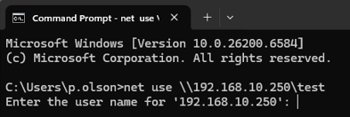
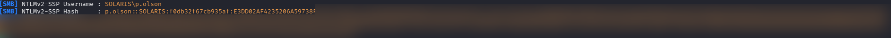

# 🔍 Phase 1 Findings — LLMNR/NBT-NS Poisoning

## 📌 Summary

LLMNR and NBT-NS poisoning successfully exposed NTLMv2 authentication material from a domain-connected workstation.

The attack required:
- no malware
- no privileged access
- no software exploitation

This demonstrates the security risk associated with legacy broadcast-based name resolution protocols within enterprise environments.

---

# 🎯 Captured Authentication Material

## Compromised Account

```text
SOLARIS\p.olson
```

## Credential Type

```text
NTLMv2 Challenge-Response Hash
```

---

# 🔐 Privilege Observations

The compromised account operated as a standard domain user without elevated administrative privileges.

## Account Context

- **User:** Peggy Olson (`p.olson`)
- **Title:** Copywriter
- **Organizational Unit (OU):** `02-Creative`

Observed group memberships later included:

- Domain Users
- Users

At this stage, no direct privilege escalation path was identified.

---

# 📊 Detection Opportunities

Potentially observable activity generated during this phase included:

- Abnormal LLMNR traffic
- NBT-NS broadcast responses
- Rogue SMB authentication behavior
- Unexpected internal authentication traffic

Relevant monitoring sources include:

| Source | Visibility |
|---|---|
| Sysmon | Network activity |
| Windows Security Logs | Authentication attempts |
| IDS/IPS | Broadcast poisoning behavior |
| Network Monitoring | LLMNR/NBT-NS anomalies |

---

# ⚠️ Security Weaknesses Identified

The attack succeeded due to several environmental weaknesses:

- LLMNR enabled
- NBT-NS enabled
- Lack of network segmentation
- Insecure fallback authentication behavior

---

# 🛡️ Defensive Considerations

Recommended defensive improvements include:

- Disable LLMNR
- Disable NBT-NS
- Enforce SMB signing
- Monitor internal authentication anomalies
- Restrict unnecessary broadcast traffic

---

# 📈 Risk Assessment

| Category | Rating |
|---|---|
| Severity | High |
| Likelihood | High |
| Impact | Medium |

## Business Risk

Successful credential interception may allow attackers to establish initial access within enterprise environments without requiring malware or software exploitation.

This can lead to:
- credential abuse
- lateral movement
- privilege escalation
- broader Active Directory compromise

---

# 📸 Evidence

## Authentication Trigger from Domain Workstation



A network authentication request was triggered from the domain workstation using an SMB connection attempt against the attacker-controlled host.

This caused the workstation to perform NTLM authentication over SMB.

---

## NTLMv2 Authentication Material Captured via Responder



Responder successfully intercepted the authentication request and captured NTLMv2 challenge-response material associated with the compromised domain user account.

The captured authentication material established the initial foothold within the environment.
