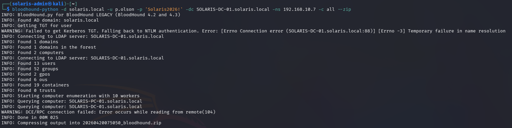
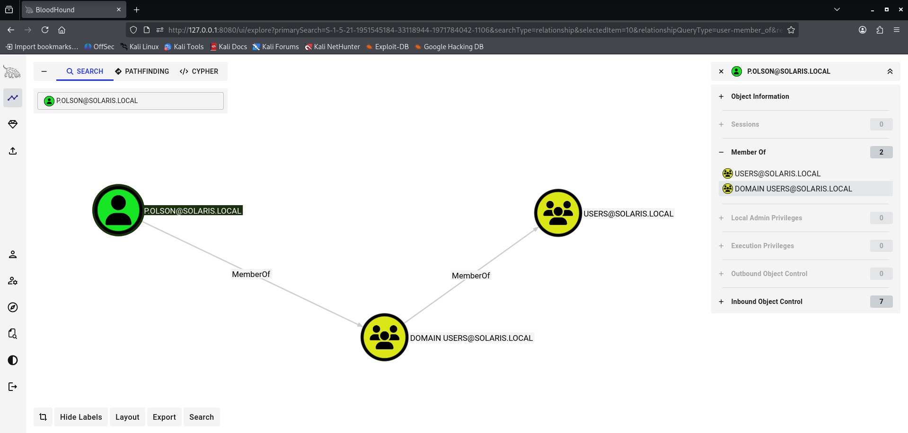
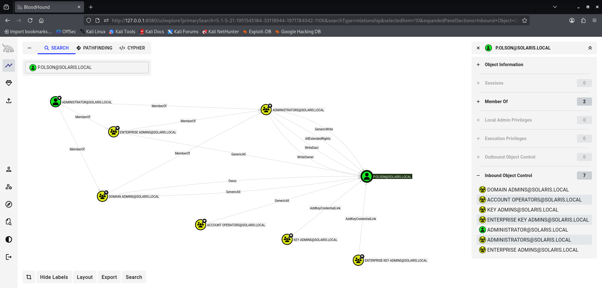
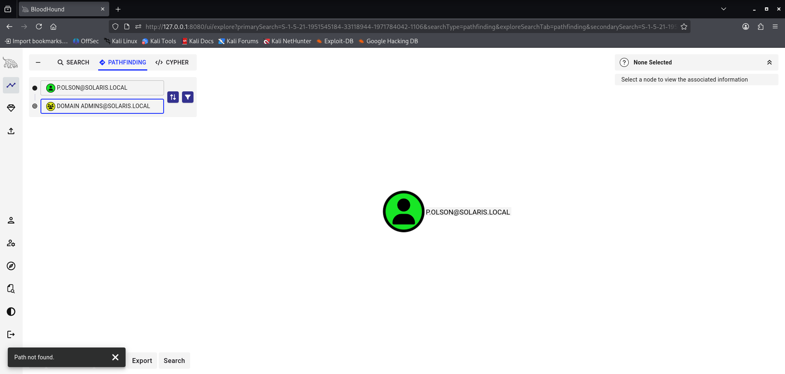

# 🔍 Phase 3 Findings — Active Directory Enumeration & Attack Path Analysis

## 📌 Summary

Active Directory enumeration successfully mapped the internal enterprise environment and identified privilege relationships associated with the compromised account.

BloodHound analysis confirmed that the compromised user operated with standard domain user privileges and did not possess a direct path to Domain Admin access.

Although several inbound object control relationships were identified, no immediately exploitable privilege escalation path was confirmed during this phase.

This forced a strategic pivot toward additional credential access and post-exploitation activity.

---

# 🎯 Enumerated Domain Information

BloodHound collection successfully identified:

- Domain users
- Security groups
- Computers
- Organizational Units (OUs)
- Group Policy Objects (GPOs)
- ACL relationships
- Trust relationships

## Identified Domain

```text
solaris.local
```

---

# 🔐 Privilege Observations

The compromised account operated as a standard domain user without elevated administrative privileges.

## Account Context

- **User:** Peggy Olson (`p.olson`)
- **Title:** Copywriter
- **Organizational Unit (OU):** `02-Creative`

Observed group memberships included:

- Domain Users
- Users

No local administrator privileges or direct administrative execution privileges were identified during this phase.

---

# 🧠 ACL & Relationship Analysis

BloodHound analysis identified several inbound object control relationships associated with the compromised account.

Observed relationship types included:

- GenericWrite
- WriteDacl
- AddKeyCredentialLink

Although these relationships were identified, no immediately exploitable privilege escalation path was confirmed within the current attack context.

This demonstrates the importance of validating ACL exposure carefully rather than assuming all object control relationships are directly exploitable.

---

# 🚫 No Direct Path to Domain Admins

Pathfinding analysis between the compromised account and Domain Admins returned no valid escalation path.

This was a critical operational finding because it confirmed that:

- direct privilege escalation was unavailable
- additional attack stages would be required
- credential access remained the most viable progression strategy

The absence of a direct attack path reinforced the need for:

- lateral movement attempts
- credential dumping
- post-exploitation credential access

in later phases.

---

# 🧠 Attack Conclusions

Several important operational conclusions were identified during this phase:

- Valid credentials do not guarantee privilege escalation opportunities
- Enumeration is essential before exploitation attempts
- ACL relationships require contextual analysis
- BloodHound results must be operationally validated
- Attack progression frequently depends on post-exploitation credential access

This phase demonstrates how realistic enterprise attacks often involve reconnaissance, reassessment, and operational pivots rather than immediate privilege escalation.

---

# 📊 Detection Opportunities

Potentially observable activity generated during this phase included:

- LDAP enumeration activity
- Active Directory object collection
- BloodHound data collection behavior
- Large-scale domain queries
- Group membership enumeration
- ACL analysis activity

Relevant monitoring sources include:

| Source | Visibility |
|---|---|
| Windows Security Logs | Authentication activity |
| LDAP Monitoring | Directory enumeration |
| Sysmon | Process execution |
| PowerShell Logging | Enumeration tooling |
| SIEM Correlation | Large-scale AD queries |

Relevant Windows Event IDs may include:

| Event ID | Description |
|---|---|
| 4624 | Successful authentication |
| 4662 | Directory service object access |
| 1644 | LDAP query logging |

---

# ⚠️ Security Weaknesses Identified

The enumeration phase revealed several environmental weaknesses:

- Excessive visibility into AD relationships
- Broad directory enumeration access
- Potentially dangerous ACL relationships
- Lack of segmentation between users and sensitive directory information

---

# 🛡️ Defensive Considerations

Recommended defensive improvements include:

- Audit excessive ACL permissions
- Restrict unnecessary object control relationships
- Monitor abnormal LDAP query volume
- Detect BloodHound-style collection behavior
- Implement tiered administrative separation
- Limit visibility into privileged relationships where possible

---

# 📈 Risk Assessment

| Category | Rating |
|---|---|
| Severity | Medium |
| Likelihood | High |
| Impact | High |

## Business Risk

Successful Active Directory enumeration provides attackers with critical insight into enterprise identity structure, privilege relationships, and potential attack paths.

This significantly improves attacker operational awareness and increases the likelihood of successful privilege escalation and lateral movement activity in later attack phases.

---

# 📸 Evidence

## BloodHound Data Collection Successful



BloodHound successfully collected Active Directory object data including users, groups, computers, ACLs, and organizational relationships from the domain environment.

---

## Compromised User Group Membership Analysis



BloodHound analysis confirmed that the compromised account operated with standard domain user privileges and belonged only to low-privileged domain groups.

---

## Inbound Object Control Relationships



Analysis identified several inbound object control relationships associated with the compromised account including GenericWrite, WriteDacl, and AddKeyCredentialLink permissions.

---

## No Direct Path to Domain Admins



Pathfinding analysis confirmed that no direct privilege escalation path existed between the compromised account and the Domain Admins group.

This reinforced the need for additional post-exploitation and credential access activity in later attack phases.
