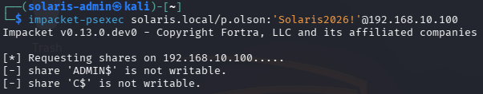
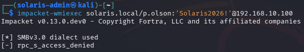

# 🔍 Phase 4 Findings — Lateral Movement Attempt & Privilege Boundary Validation

## 📌 Summary

Remote execution attempts using valid domain credentials were unsuccessful due to insufficient privileges.

Although authentication against internal systems succeeded, the compromised account lacked the administrative permissions required for:

- SMB administrative share access
- Remote service creation
- WMI execution

This phase demonstrated effective privilege boundary enforcement within the environment and reinforced the distinction between authentication and authorization.

---

# 🎯 Authentication Results

## Compromised Account

```text
SOLARIS\p.olson
```

## Authentication Status

```text
Successful
```

## Remote Execution Status

```text
Access Denied
```

---

# 🔐 Privilege Observations

The compromised account operated with standard domain user privileges and did not possess local administrator access on the target workstation.

## Account Context

- **User:** Peggy Olson (`p.olson`)
- **Title:** Copywriter
- **Organizational Unit (OU):** `02-Creative`

Observed restrictions included:

- ADMIN$ share inaccessible
- C$ share inaccessible
- RPC access denied for WMI execution

No evidence of privileged execution capability was identified during this phase.

---

# 🧠 Attack Conclusions

Several important operational conclusions were identified during this phase:

- Valid credentials alone were insufficient for lateral movement
- Administrative authorization remained properly restricted
- Multiple remote execution methods failed consistently
- Privilege boundaries meaningfully slowed attacker progression

This phase reinforced the need for:

- privilege escalation
- credential dumping
- additional credential exposure

before successful remote execution could occur.

---

# 📊 Detection Opportunities

Potentially observable activity generated during this phase included:

- Remote SMB authentication attempts
- Failed access to administrative shares
- Remote service creation attempts
- RPC access failures
- WMI execution attempts

Relevant monitoring sources include:

| Source | Visibility |
|---|---|
| Windows Security Logs | Authentication and access failures |
| Sysmon | Process execution and network activity |
| SMB Logs | Administrative share access attempts |
| WMI Logs | Remote execution activity |
| SIEM Correlation | Lateral movement patterns |

Relevant Windows Event IDs may include:

| Event ID | Description |
|---|---|
| 4624 | Successful logon |
| 4625 | Failed logon |
| 5140 | SMB share access |
| 4688 | Process creation |

---

# ⚠️ Security Weaknesses Identified

Although privilege escalation did not succeed, several security observations remained relevant:

- Valid domain credentials were successfully abused
- Remote authentication remained accessible
- Internal trust relationships enabled attacker interaction with systems

However, local administrative separation successfully prevented direct lateral movement.

---

# 🛡️ Defensive Considerations

Recommended defensive improvements include:

- Maintain strict least privilege controls
- Restrict unnecessary remote administration access
- Monitor failed administrative share access attempts
- Detect abnormal remote authentication behavior
- Audit local administrator group membership
- Monitor Impacket-related execution patterns

---

# 📈 Risk Assessment

| Category | Rating |
|---|---|
| Severity | Medium |
| Likelihood | High |
| Impact | Medium |

## Business Risk

Although remote execution attempts failed, successful authentication using compromised credentials still allowed attackers to interact with internal systems and validate enterprise trust relationships.

This type of access frequently serves as a precursor to later privilege escalation and credential theft activity.

---

# 📸 Evidence

## PsExec Administrative Share Access Denied



Impacket PsExec successfully authenticated against the target system but failed to access the ADMIN$ and C$ administrative shares.

This confirmed that the compromised account lacked local administrative privileges required for remote service creation.

---

## WMI Remote Execution Access Denied



Impacket WMIExec authentication succeeded but remote execution failed due to RPC access restrictions.

This reinforced that the compromised account did not possess sufficient privileges for remote administrative execution.
