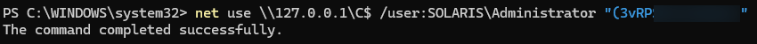
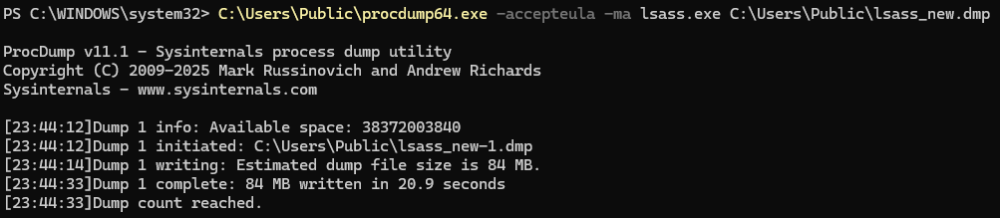
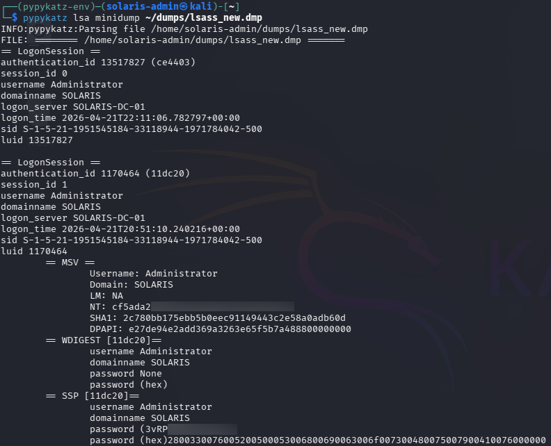

# 🔍 Phase 5 Findings — LSASS Memory Dumping & Credential Extraction

## 📌 Summary

Credential extraction from LSASS memory successfully exposed privileged authentication material after an initial dump failed to reveal reusable credentials.

The attack demonstrated that authentication activity can dynamically influence the credential material stored within LSASS memory.

By triggering a privileged SMB authentication event, additional authentication material became available within memory and was successfully extracted during a subsequent dump analysis.

This phase enabled privilege escalation and significantly increased attacker capability within the environment.

---

# 🎯 Extracted Credentials

## Compromised Privileged Account

```text
SOLARIS\Administrator
```

## Recovered Authentication Material

```text
NTLM Hash
Cleartext Password
Authentication Session Data
```

## Credential Exposure Status

```text
Successful
```

---

# 🔐 Privilege Observations

The extracted credentials belonged to the built-in domain Administrator account.

Recovered authentication material provided:

- Administrative system access
- Remote SMB authentication capability
- Elevated privilege execution potential
- Domain compromise capability

This represented a significant privilege escalation from the previously compromised low-privileged domain user account.

---

# 🧠 Attack Conclusions

Several important operational conclusions were identified during this phase:

- LSASS credential exposure can depend on active authentication sessions
- Initial credential dumping attempts may not immediately succeed
- Authentication activity can introduce new reusable credential material into memory
- Credential dumping remains one of the most effective post-exploitation techniques within Windows environments

This phase demonstrated realistic attacker adaptation following earlier failed lateral movement attempts.

The attacker reassessed the environment, generated additional authentication activity, and successfully extracted privileged credentials during a second analysis cycle.

---

# 📊 Detection Opportunities

Potentially observable activity generated during this phase included:

- LSASS memory access
- ProcDump execution
- Credential dumping behavior
- Authentication session creation
- SMB authentication activity
- Suspicious process access patterns

Relevant monitoring sources include:

| Source | Visibility |
|---|---|
| Sysmon | Process access and memory interaction |
| Windows Security Logs | Authentication events |
| EDR/AV Telemetry | LSASS access behavior |
| PowerShell Logging | Command execution |
| SIEM Correlation | Credential dumping patterns |

Relevant Windows Event IDs may include:

| Event ID | Description |
|---|---|
| 4624 | Successful logon |
| 4688 | Process creation |
| Sysmon Event ID 1 | Process execution |
| Sysmon Event ID 10 | Process access |

---

# ⚠️ Security Weaknesses Identified

The attack succeeded due to several environmental weaknesses:

- Inadequate LSASS protection
- Absence of credential isolation controls
- High-privileged authentication activity on active systems
- Insufficient EDR or credential dumping prevention controls

---

# 🛡️ Defensive Considerations

Recommended defensive improvements include:

- Enable LSASS protection (RunAsPPL)
- Deploy Credential Guard
- Restrict privileged logons to hardened systems
- Monitor LSASS access attempts
- Detect ProcDump and credential dumping behavior
- Deploy EDR capable of detecting memory access abuse
- Minimize privileged session exposure on workstations

---

# 📈 Risk Assessment

| Category | Rating |
|---|---|
| Severity | Critical |
| Likelihood | Medium |
| Impact | Critical |

## Business Risk

Successful credential extraction from LSASS memory can rapidly escalate attacker capability and enable full compromise of enterprise systems and Active Directory infrastructure.

Exposure of privileged authentication material significantly increases the likelihood of lateral movement, persistence, and domain-wide compromise.

---

# 📸 Evidence

## Forced SMB Authentication Session



A privileged SMB authentication event was intentionally triggered to generate a new authentication session within LSASS memory.

This introduced additional reusable credential material into the active authentication context.

---

## ProcDump LSASS Memory Acquisition



ProcDump successfully created a full memory dump of the LSASS process for offline credential analysis.

The dump file was later transferred to the attacker-controlled system for parsing and credential extraction.

---

## Pypykatz Administrative Credential Extraction



Pypykatz successfully parsed the LSASS dump and recovered privileged authentication material associated with the Administrator account.

Recovered data included NTLM hashes and cleartext credential material, enabling privilege escalation and later domain compromise activity.
