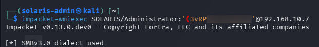
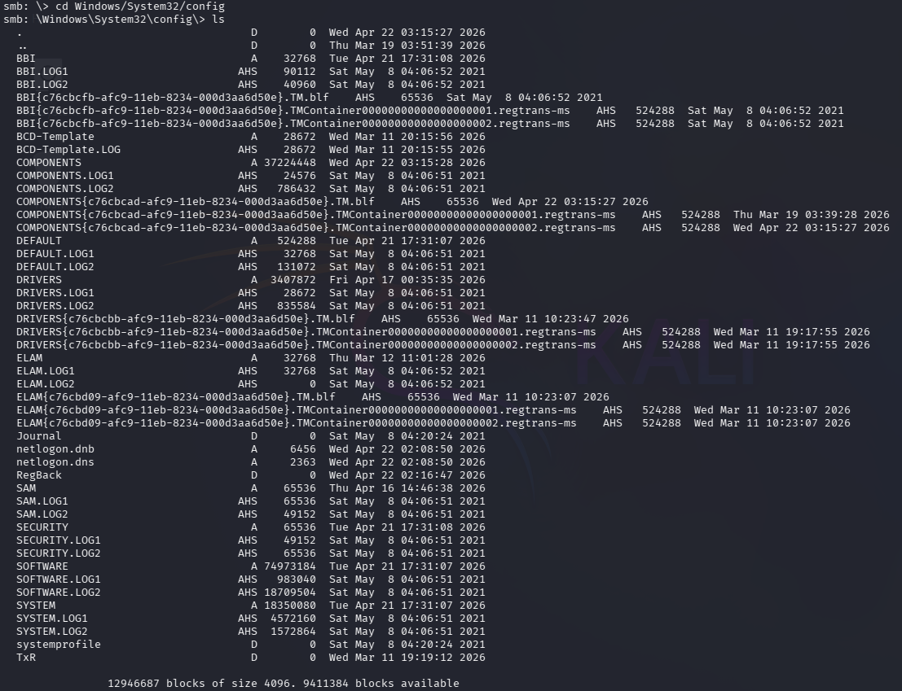

# 🔍 Phase 6 Findings — Administrative Share Access & Privileged System Interaction

## 📌 Summary

Recovered Administrator credentials successfully enabled privileged remote interaction with the Domain Controller.

The attack validated that previously extracted credentials provided:

- Remote administrative execution
- Access to protected system resources
- Interaction with sensitive operating system components

This phase confirmed successful privilege escalation and established operational administrative control over the target system.

---

# 🎯 Administrative Access Validation

## Compromised Privileged Account

```text
SOLARIS\Administrator
```

## Access Status

```text
Successful
```

## Remote Execution Status

```text
Administrative Access Confirmed
```

---

# 🔐 Privilege Observations

The recovered credentials provided full administrative execution capability on the Domain Controller.

Confirmed capabilities included:

- Remote command execution
- Administrative filesystem access
- Access to protected system directories
- Interaction with sensitive registry hive storage locations

Accessible protected files included:

```text
SAM
SYSTEM
SECURITY
```

These files are highly sensitive because they contain authentication, credential, and operating system configuration data.

---

# 🧠 Attack Conclusions

Several important operational conclusions were identified during this phase:

- LSASS credential dumping successfully enabled privilege escalation
- Administrative credentials provided unrestricted remote interaction capability
- Sensitive system resources became accessible immediately after privileged authentication
- Protected operating system files were exposed to authenticated administrative access

This phase demonstrated how rapidly enterprise compromise can progress once privileged credentials are exposed.

---

# 📊 Detection Opportunities

Potentially observable activity generated during this phase included:

- Remote administrative authentication
- WMI-based remote execution
- Administrative share interaction
- Access to sensitive system directories
- Registry hive access activity
- Abnormal privileged session behavior

Relevant monitoring sources include:

| Source | Visibility |
|---|---|
| Windows Security Logs | Privileged authentication |
| Sysmon | Process execution and network activity |
| WMI Logs | Remote execution activity |
| PowerShell Logging | Administrative command execution |
| SIEM Correlation | Lateral movement and privileged access |

Relevant Windows Event IDs may include:

| Event ID | Description |
|---|---|
| 4624 | Successful logon |
| 4672 | Special privileges assigned |
| 4688 | Process creation |
| 5140 | SMB share access |

---

# ⚠️ Security Weaknesses Identified

The attack succeeded due to several environmental weaknesses:

- Exposure of privileged credentials within LSASS memory
- Lack of credential isolation protections
- Excessive trust in privileged authentication
- Insufficient monitoring of remote administrative activity

---

# 🛡️ Defensive Considerations

Recommended defensive improvements include:

- Restrict privileged authentication exposure
- Harden Domain Controller administrative access
- Monitor abnormal WMI execution activity
- Detect administrative share abuse
- Enable credential isolation protections
- Deploy EDR monitoring for remote administrative behavior
- Restrict unnecessary privileged sessions

---

# 📈 Risk Assessment

| Category | Rating |
|---|---|
| Severity | Critical |
| Likelihood | High |
| Impact | Critical |

## Business Risk

Successful administrative access to a Domain Controller significantly increases the likelihood of enterprise-wide compromise.

Attackers with privileged execution capability can access sensitive credential databases, establish persistence, and compromise core Active Directory infrastructure.

---

# 📸 Evidence

## Remote Administrative Access via WMIExec



Recovered Administrator credentials successfully authenticated against the Domain Controller and established privileged remote command execution.

This confirmed successful privilege escalation and validated administrative execution capability within the environment.

---

## Access to Sensitive Registry Hive Storage



Administrative access enabled interaction with protected Windows registry hive storage files including SAM, SYSTEM, and SECURITY.

Access to these files demonstrates effective administrative control over sensitive operating system components and credential-related resources.
