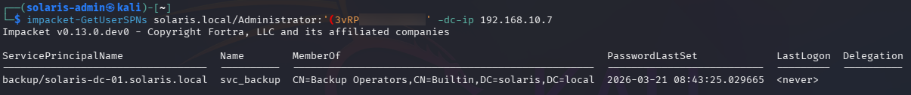
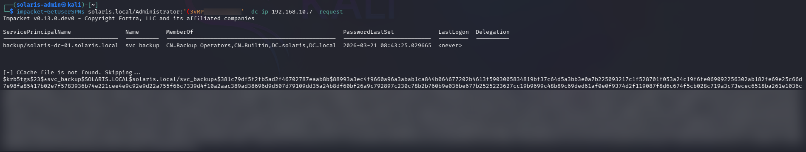
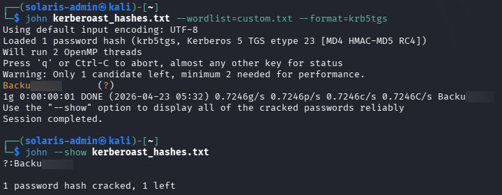

# 🔍 Phase 7 Findings — Kerberoasting & Service Account Credential Extraction

## 📌 Summary

Kerberoasting successfully exposed credentials associated with a privileged Active Directory service account.

The attack identified a Kerberoastable service account configured with a Service Principal Name (SPN), extracted its Kerberos TGS hash, and recovered the cleartext password through offline cracking.

This phase demonstrated how weak service account password practices significantly expand enterprise attack surface exposure.

---

# 🎯 Compromised Service Account

## Account Name

```text
svc_backup
```

## Group Membership

```text
Backup Operators
```

## Credential Recovery Status

```text
Successful
```

## Recovered Password

```text
Backu<REDACTED>
```

---

# 🔐 Privilege Observations

The compromised service account possessed membership within the:

```text
Backup Operators
```

group.

Backup Operators privileges may allow:

- Backup-related filesystem access
- Interaction with sensitive system files
- Potential registry hive access
- Certain privilege escalation opportunities

However, within this environment, Backup Operators privileges alone were insufficient to directly perform unrestricted remote exploitation.

This demonstrates the importance of validating privilege assumptions operationally rather than relying solely on group membership analysis.

---

# 🧠 Attack Conclusions

Several important operational conclusions were identified during this phase:

- Service accounts configured with SPNs significantly expand attack surface exposure
- Weak service account passwords remain highly exploitable
- Kerberoasting enables offline password attacks without continuous target interaction
- Kerberos service ticket abuse remains highly effective within enterprise environments
- Service account privilege analysis must be operationally validated

This phase demonstrated realistic Active Directory attack progression through chained credential access techniques.

---

# 📊 Detection Opportunities

Potentially observable activity generated during this phase included:

- SPN enumeration activity
- Kerberos TGS requests
- Abnormal service ticket requests
- Offline password cracking preparation
- Service account targeting behavior

Relevant monitoring sources include:

| Source | Visibility |
|---|---|
| Windows Security Logs | Kerberos authentication activity |
| Domain Controller Logs | TGS requests |
| Sysmon | Process execution |
| SIEM Correlation | Abnormal Kerberos patterns |

Relevant Windows Event IDs may include:

| Event ID | Description |
|---|---|
| 4768 | Kerberos authentication ticket requested |
| 4769 | Kerberos service ticket requested |
| 4624 | Successful authentication |
| 4688 | Process creation |

---

# ⚠️ Security Weaknesses Identified

The attack succeeded due to several environmental weaknesses:

- Weak service account password
- Exposed SPN configuration
- Lack of service account password hardening
- Excessive trust in service account authentication

---

# 🛡️ Defensive Considerations

Recommended defensive improvements include:

- Enforce strong randomized service account passwords
- Use Group Managed Service Accounts (gMSAs)
- Monitor abnormal TGS request volume
- Detect Kerberoasting behavior
- Restrict unnecessary SPN exposure
- Rotate service account credentials regularly
- Audit privileged service account membership

---

# 📈 Risk Assessment

| Category | Rating |
|---|---|
| Severity | High |
| Likelihood | High |
| Impact | High |

## Business Risk

Successful Kerberoasting can expose privileged service account credentials without requiring direct exploitation of the target system.

Compromised service accounts can significantly expand attacker operational capability and increase the likelihood of lateral movement and privilege escalation within enterprise environments.

---

# 📸 Evidence

## SPN Service Account Enumeration



Service Principal Name enumeration identified the `svc_backup` account as a Kerberoastable service account within the environment.

The account was also observed to possess membership within the Backup Operators group.

---

## Kerberos TGS Hash Extraction



A Kerberos service ticket (TGS) was successfully requested and extracted for the target service account.

The extracted hash was later used for offline password cracking.

---

## Service Account Password Successfully Cracked



Offline cracking using John the Ripper successfully recovered the cleartext password associated with the service account.

This demonstrated the security risk posed by weak service account credential practices within Active Directory environments.
