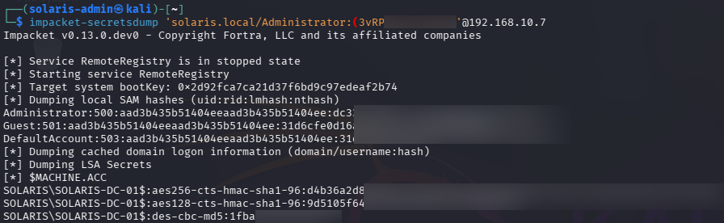
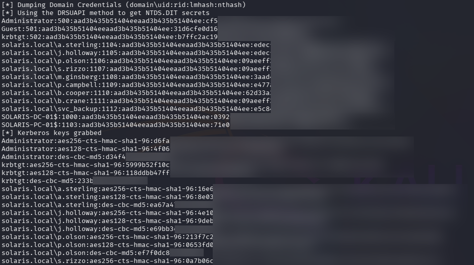

# 🔍 Phase 8 Findings — NTDS Extraction & Full Active Directory Compromise

## 📌 Summary

The attack successfully achieved full Active Directory compromise through extraction of the NTDS.dit credential database from the Domain Controller.

Using previously recovered Administrator credentials, the attacker extracted:

- Domain NTLM password hashes
- Kerberos encryption keys
- Service account credential material
- Machine account secrets
- `krbtgt` account authentication material

This phase demonstrated complete compromise of enterprise identity infrastructure within the environment.

---

# 🎯 Domain Credential Exposure

## Compromised Domain Infrastructure

```text
solaris.local
```

## Credential Exposure Status

```text
Full Domain Credential Exposure
```

## Extracted Authentication Material

```text
NTLM Password Hashes
Kerberos AES Keys
Kerberos RC4 Keys
Machine Account Secrets
krbtgt Credential Material
```

---

# 🔐 Privilege Observations

The attack exposed credential material associated with:

- Domain Administrators
- Standard domain users
- Service accounts
- Machine accounts
- Kerberos trust infrastructure

Particularly sensitive accounts included:

```text
Administrator
krbtgt
svc_backup
```

Compromise of the `krbtgt` account significantly impacts Kerberos trust integrity throughout the domain.

---

# 🧠 Attack Conclusions

Several important operational conclusions were identified during this phase:

- Domain Controller compromise enables unrestricted access to enterprise identity infrastructure
- NTDS extraction provides attackers with domain-wide credential visibility
- Administrative access to Domain Controllers represents catastrophic enterprise risk
- Kerberos trust relationships become exposed after `krbtgt` compromise
- Chained attack paths can escalate minor weaknesses into enterprise-wide compromise

This phase demonstrated realistic progression from initial foothold to full Active Directory compromise.

---

# 📊 Detection Opportunities

Potentially observable activity generated during this phase included:

- Remote administrative authentication
- NTDS extraction operations
- Registry and credential database access
- Abnormal secretsdump execution behavior
- Kerberos key extraction activity
- Large-scale credential access operations

Relevant monitoring sources include:

| Source | Visibility |
|---|---|
| Windows Security Logs | Privileged authentication |
| Sysmon | Process execution and credential access |
| EDR Telemetry | NTDS interaction behavior |
| PowerShell Logging | Administrative command execution |
| SIEM Correlation | Domain-wide credential access activity |

Relevant Windows Event IDs may include:

| Event ID | Description |
|---|---|
| 4624 | Successful logon |
| 4672 | Special privileges assigned |
| 4688 | Process creation |
| Sysmon Event ID 1 | Process execution |
| Sysmon Event ID 10 | Sensitive process access |

---

# ⚠️ Security Weaknesses Identified

The attack succeeded due to multiple chained weaknesses including:

- Weak password practices
- Exposed service account credentials
- Credential exposure within LSASS memory
- Insufficient protection of privileged authentication material
- Excessive trust associated with Domain Controller administrative access

---

# 🛡️ Defensive Considerations

Recommended defensive improvements include:

- Harden Domain Controller administrative access
- Restrict privileged logons
- Deploy Credential Guard and LSASS protection
- Monitor abnormal NTDS access activity
- Detect Impacket `secretsdump` behavior
- Rotate compromised `krbtgt` credentials after incident response
- Implement privileged access workstations (PAWs)
- Deploy tiered administration controls

---

# 📈 Risk Assessment

| Category | Rating |
|---|---|
| Severity | Critical |
| Likelihood | High |
| Impact | Critical |

## Business Risk

Successful NTDS extraction represents catastrophic enterprise compromise.

Attackers gaining access to domain-wide credential material can compromise authentication trust relationships, perform unrestricted lateral movement, establish persistence, and maintain long-term control over enterprise identity infrastructure.

---

# 📸 Evidence

## NTDS Extraction via secretsdump



Impacket `secretsdump` successfully authenticated to the Domain Controller using recovered Administrator credentials and initiated NTDS extraction operations.

This validated unrestricted privileged access to Active Directory credential infrastructure.

---

## Domain Credential Hash Extraction



The NTDS extraction process successfully recovered domain-wide credential material including NTLM password hashes, Kerberos encryption keys, machine account secrets, and `krbtgt` authentication material.

This confirmed effective compromise of the Active Directory identity infrastructure.
