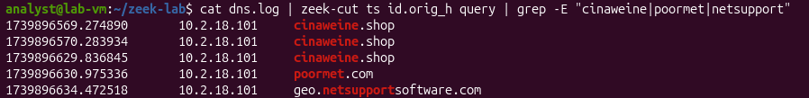
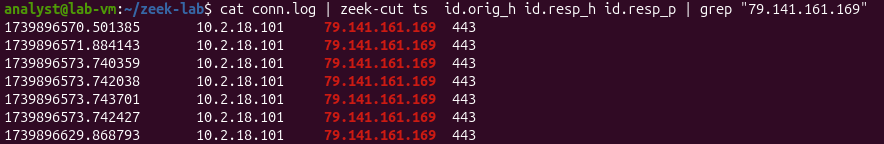
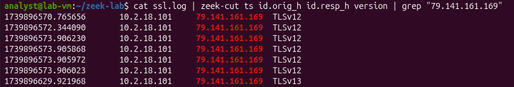
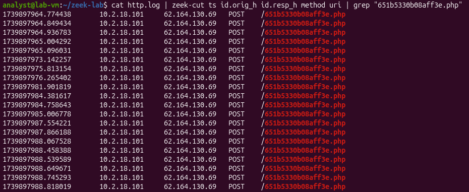
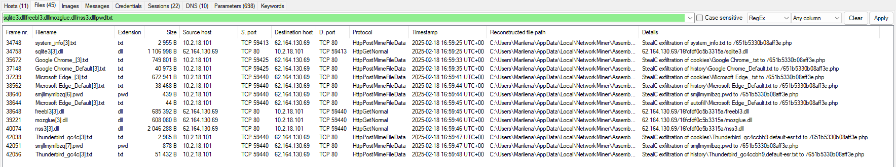
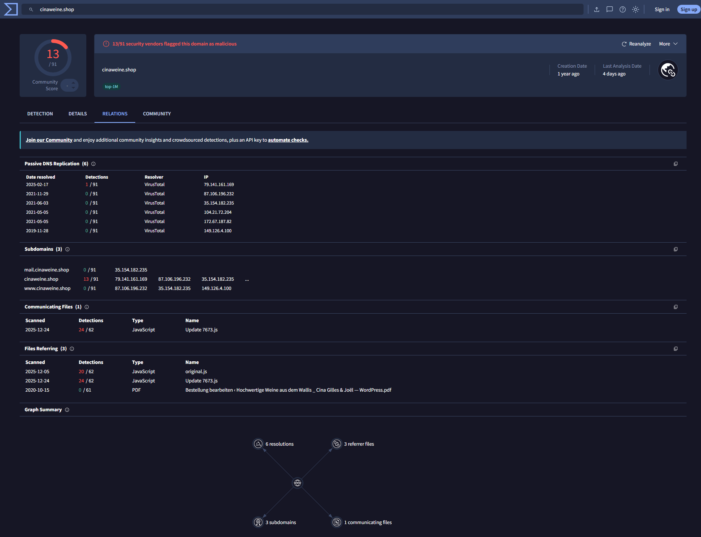
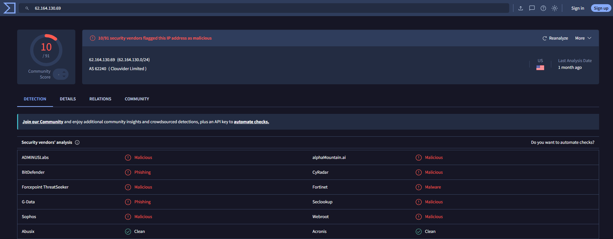

# 🛡️ Malware Traffic Analysis: NetSupport RAT & StealC Investigation

## 📌 Overview
This project presents a network traffic **and log-based analysis (Zeek)** of a malware infection chain involving a SmartApeSG fake browser update leading to NetSupport RAT and StealC.

The analysis focuses on identifying command-and-control (C2) communication, suspicious DNS activity, encrypted traffic, payload delivery, and potential data exfiltration through a combination of Zeek log analysis, packet inspection, artifact extraction, and threat intelligence enrichment.

📄 **Full Investigation Report:** [malware_traffic_analysis.pdf](report/malware_traffic_analysis.pdf)

---

## 📋 Executive Summary

Analysis of a malware infection originating from a SmartApeSG fake browser update identified compromise of internal host **10.2.18.101** and subsequent command-and-control (C2) communication associated with **NetSupport RAT**.

The investigation revealed repeated encrypted outbound connections to attacker-controlled infrastructure, suspicious DNS activity, payload delivery, and evidence consistent with **StealC information-stealing malware**. Analysis of network traffic and Zeek logs identified indicators of compromise (IOCs), command-and-control beaconing behavior, and HTTP POST activity indicative of potential data exfiltration.

The findings were validated through packet analysis, log correlation, artifact extraction, and threat intelligence enrichment using VirusTotal and NetworkMiner.

---

## 🎯 Objectives
- Identify infected host and attacker infrastructure  
- Analyze DNS and connection behavior  
- Detect command-and-control (C2) communication  
- Investigate encrypted traffic patterns  
- Analyze network logs (Zeek) to identify malicious behavior  
- Extract and validate Indicators of Compromise (IOCs)  
- Map observed activity to MITRE ATT&CK  

---

## ⏱️ Attack Timeline

| Stage | Observed Activity |
|---------|---------|
| Initial Access | User interacted with SmartApeSG fake browser update |
| DNS Activity | Resolution of suspicious domains including `cinaweine.shop` and `poormet.com` |
| Payload Delivery | Malware-related content retrieved from external infrastructure |
| C2 Establishment | Repeated outbound connections to `79.141.161.169:443` |
| Encrypted Communications | TLS-encrypted traffic observed without corresponding HTTP visibility |
| Secondary Malware Activity | Indicators consistent with StealC observed |
| Data Exfiltration | HTTP POST requests and outbound artifact transfers identified |

---

## 🧪 Tools Used
- Wireshark (packet analysis)  
- Zeek (network log generation & behavioral analysis)  
- VirusTotal (IOC validation)  
- NetworkMiner (artifact extraction)  

---

## 🔬 Investigation Methodology

The investigation followed a structured incident response workflow:

1. Review Zeek DNS logs to identify suspicious domains.
2. Correlate DNS activity with external IP infrastructure.
3. Analyze connection patterns using Zeek connection logs.
4. Investigate encrypted communications through TLS logs.
5. Examine HTTP activity for payload delivery and exfiltration behavior.
6. Extract artifacts using NetworkMiner.
7. Validate indicators through VirusTotal.
8. Map observed attacker behavior to MITRE ATT&CK techniques.
9. Document findings and assess overall incident impact.

---

## 🔍 Key Findings
- Internal host **10.2.18.101** identified as infected  
- Communication with external infrastructure including:
  - **79.141.161.169**
  - **62.164.130.69**
  - **194.180.191.229**
- Suspicious domains observed:
  - `cinaweine.shop`
  - `poormet.com`
  - `geo.netsupportsoftware.com`
- Evidence of **encrypted communication (TLS)** masking payload delivery  
- Repeated outbound connections consistent with **C2 beaconing behavior**  
- HTTP POST requests indicating **possible data exfiltration**  
- Malware staging behavior through external DLL retrieval  

---

## 📸 Investigation Evidence

### Suspicious DNS Activity



Zeek DNS logs revealed repeated queries from host **10.2.18.101** to domains associated with the infection chain, including `cinaweine.shop`, `poormet.com`, and `geo.netsupportsoftware.com`.

---

### Command-and-Control Beaconing



Analysis of Zeek connection logs revealed repeated outbound connections from the infected host (**10.2.18.101**) to external IP address (**79.141.161.169**) over TCP port **443**. The consistent destination, port usage, and recurring connection pattern are indicative of command-and-control (C2) beaconing activity commonly associated with remote access trojans such as NetSupport RAT.

---

### Encrypted Communications



Analysis of Zeek SSL logs confirmed that communications between the infected host (**10.2.18.101**) and external infrastructure (**79.141.161.169**) occurred over **TLSv1.2** and **TLSv1.3**. The use of encrypted channels reduced visibility into payload contents and is consistent with command-and-control traffic designed to evade network inspection.

---

### HTTP POST Activity



Analysis of Zeek HTTP logs identified repeated POST requests from the infected host (**10.2.18.101**) to attacker-controlled infrastructure (**62.164.130.69**). The requests targeted the endpoint `/651b5330b08aff3e.php` and are consistent with command-and-control communications and potential data exfiltration activity associated with StealC.

---

### Artifact Extraction and Potential Data Exfiltration



NetworkMiner artifact extraction revealed the delivery of multiple DLL files from attacker-controlled infrastructure (**62.164.130.69**) to the infected host (**10.2.18.101**). Additional recovered artifacts included browser-related files, system information, and credential-associated data transmitted from the infected host, supporting evidence of StealC activity and potential data exfiltration.

---

### Threat Intelligence Validation



The domain `cinaweine.shop`, identified during DNS analysis, was validated through VirusTotal threat intelligence enrichment. The domain was associated with malicious detections, infrastructure linked to the investigation (including `79.141.161.169`), and related malicious files such as `Update7673.js`. These relationships increased confidence in the attribution of the observed activity to the NetSupport RAT and StealC infection chain.

---

### Infrastructure Reputation Validation



The IP address `62.164.130.69`, identified during HTTP POST analysis and artifact extraction, was validated through VirusTotal threat intelligence. Multiple security vendors classified the infrastructure as malicious, phishing-related, or malware-associated, providing additional confidence that the observed communications were linked to attacker-controlled infrastructure involved in the infection chain.

---

## 🚨 Indicators of Compromise (IOCs)

### IP Addresses
- 79.141.161.169  
- 62.164.130.69  
- 194.180.191.229  

### Domains
- cinaweine.shop  
- poormet.com  
- geo.netsupportsoftware.com

For a complete IOC list, see:
`iocs/indicators.csv`

---

## 🧠 MITRE ATT&CK Mapping (Summary)

| Technique | ATT&CK ID |
|------------|------------|
| Command and Scripting Interpreter | T1059 |
| Ingress Tool Transfer | T1105 |
| Application Layer Protocol | T1071 |
| Exfiltration Over C2 Channel | T1041 |
| Encrypted Channel | T1573 |

*(See full mapping in report)*

---

## 🛡️ Detection Engineering

The investigation findings were translated into operational detection content to support threat hunting and future detection efforts.

### Sigma Rule

- `detection/sigma/netsupport_rat.yml`

Network-based Sigma detection targeting infrastructure associated with NetSupport RAT and StealC activity observed during the investigation.

### Splunk Hunting Queries

- `detection/splunk/hunting_queries.md`

Threat hunting queries designed to identify malicious infrastructure, suspicious DNS activity, HTTP POST requests, and encrypted communications observed throughout the infection chain.

### YARA Detection Notes

- `detection/yara/notes.md`

Documentation outlining potential malware-focused detection opportunities and future signature development considerations.

---

## 📂 Investigation Artifacts
- Zeek logs (`conn.log`, `dns.log`, `http.log`, `ssl.log`)  
- PCAP file  
- Extracted network indicators  
- Analysis screenshots (Wireshark / Zeek output)  

---

## 📁 Project Structure

```text
Malware-Traffic-Analysis/
│
├── README.md
│
├── report/
│   └── malware_traffic_analysis.pdf
│
├── pcap/
│   └── README.md
│
├── logs/
│   ├── README.md
│   ├── conn-analysis.md
│   ├── dns-analysis.md
│   ├── http-analysis.md
│   └── ssl-analysis.md
│
├── screenshots/
│   ├── dns_analysis.png
│   ├── c2_beaconing.png
│   ├── tls_analysis.png
│   ├── exfiltration_activity.png
│   ├── networkminer_artifacts.png
│   ├── ioc_validation.png
│   └── ioc_validation_ip.png
│
├── iocs/
│   ├── indicators.csv
│   └── ioc_summary.md
│
└── detection/
    ├── sigma/
    │   └── netsupport_rat.yml
    │
    ├── splunk/
    │   └── hunting_queries.md
    │
    └── yara/
        └── notes.md
```

## 🧾 Data Source
PCAP sourced from:  
**Malware Traffic Analysis (Brad Duncan)**  
“2025-02-18 – SmartApeSG script for fake browser update leads to NetSupport RAT and StealC”

---

## ✅ Conclusion

The investigation identified host 10.2.18.101 as compromised following interaction with a SmartApeSG fake browser update. Analysis revealed NetSupport RAT command-and-control activity, TLS-encrypted communications, repeated HTTP POST requests, and indicators consistent with StealC information theft behavior.

By correlating Zeek logs, packet captures, NetworkMiner artifacts, and threat intelligence sources, the investigation successfully identified malicious infrastructure, extracted indicators of compromise, and mapped observed behavior to relevant MITRE ATT&CK techniques.

This project demonstrates a complete network-centric malware investigation workflow, from initial detection through IOC validation and detection engineering.

---

## 💡 Notes
This project demonstrates a practical workflow for analyzing malicious network activity by combining packet-level inspection with log-based analysis to identify attacker behavior and indicators of compromise.
